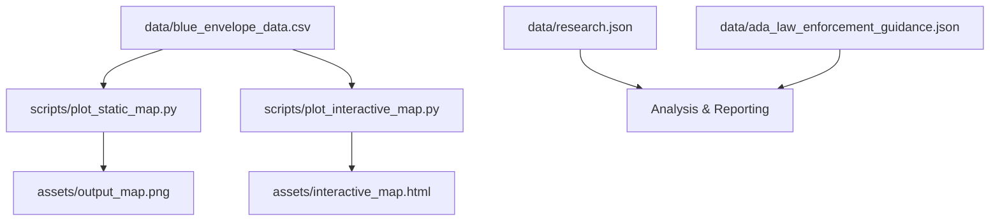

# Blue Envelope Program - Project Structure

## 📁 Directory Overview

```
blue_envelope_program/
├── assets/                     # Generated outputs and visualizations
│   ├── interactive_map.html   # Interactive choropleth map
│   └── output_map.png         # Static map visualization
├── config/                     # Configuration files
├── data/                      # Core datasets and research
│   ├── ada_law_enforcement_guidance.json  # ADA compliance guidelines
│   ├── blue_envelope_data.csv             # Primary dataset
│   ├── blue_envelope_data.json            # JSON version of dataset
│   └── research.json                      # Research on law enforcement interactions
├── docs/                      # Project documentation
│   ├── data_visualization_analysis.md     # Analysis documentation
│   ├── Union_County_NC_Implementation_Report.md  # Implementation report
│   └── PROJECT_STRUCTURE.md              # This file
├── scripts/                   # Automation and generation scripts
│   ├── create_interactive_dashboard.py   # Dashboard generation
│   ├── generate_infographics.py          # Infographic generation
│   ├── plot_interactive_map.py           # Interactive map script
│   └── plot_static_map.py               # Static map script
├── prompts/                   # AI agent configuration
│   └── PROJECT_RULES.md      # Rules for automated agents
├── .claude/                   # Claude Code configuration
├── claude.md                  # Claude Code project guidance
├── README.md                  # Main project documentation
└── requirements.txt           # Python dependencies
```

## 🗂️ File Categories

### Core Data Files
- **`data/blue_envelope_data.csv`** - Primary dataset containing state-by-state adoption information
- **`data/blue_envelope_data.json`** - JSON version of the same dataset for web applications
- **`data/research.json`** - Comprehensive research on autism-law enforcement interactions
- **`data/ada_law_enforcement_guidance.json`** - ADA compliance guidance for law enforcement

### Visualization Scripts
- **`scripts/plot_static_map.py`** - Generates static PNG maps using matplotlib/geopandas
- **`scripts/plot_interactive_map.py`** - Creates interactive HTML maps using plotly
- **`scripts/generate_infographics.py`** - Creates infographic visualizations
- **`scripts/create_interactive_dashboard.py`** - Builds comprehensive dashboards

### Generated Outputs
- **`assets/output_map.png`** - Static map showing program adoption by state
- **`assets/interactive_map.html`** - Interactive web map with hover details

### Documentation
- **`docs/Union_County_NC_Implementation_Report.md`** - Detailed implementation analysis for Union County
- **`docs/data_visualization_analysis.md`** - Analysis of visualization approaches
- **`claude.md`** - Technical guidance for Claude Code AI
- **`README.md`** - Main project documentation and setup instructions

## 🔄 Data Flow



## 🎯 Key Design Principles

### Data Integrity
- **Single source of truth**: All visualizations read from `data/blue_envelope_data.csv`
- **No hardcoded data**: Program adoption information must be verified and documented
- **Consistent schema**: Data structure follows established column names and types

### Output Standards
- **Consistent colors**: Green (Statewide), Gold (Local), Grey (None)
- **Professional quality**: High DPI for static maps, responsive design for interactive
- **Accessibility**: Clear legends, readable fonts, color-blind friendly palettes

### Code Organization
- **Separation of concerns**: Data, scripts, outputs, and documentation in distinct directories
- **Error handling**: Scripts include proper error handling and directory creation
- **Maintainability**: Clear variable names, consistent formatting, documented functions

## 🚀 Usage Patterns

### Generate All Maps
```bash
# Setup environment
pip install -r requirements.txt

# Generate visualizations
python scripts/plot_static_map.py
python scripts/plot_interactive_map.py
```

### Update Data
1. Verify new program adoption through official sources
2. Update `data/blue_envelope_data.csv`
3. Regenerate maps to reflect changes
4. Update JSON version if needed for web applications

### Add New Features
1. Create new script in `scripts/` directory
2. Follow existing error handling patterns
3. Save outputs to `assets/` directory
4. Update this documentation

## 📊 Data Schema

### Primary Dataset (`blue_envelope_data.csv`)
| Column | Type | Description |
|--------|------|-------------|
| `state` | string | State name or abbreviation |
| `adopted` | boolean | Whether any program exists |
| `adoption_type` | string | "Statewide", "Local", "Pending Statewide", or "None" |
| `localities` | string | Comma-separated list of counties/towns with local programs |
| `implementation_year` | integer | Year program was introduced |
| `notes` | string | Additional context and details |

## 🔧 Maintenance Tasks

### Regular Updates
- [ ] Verify program adoption status quarterly
- [ ] Update data files with new adoptions
- [ ] Regenerate visualizations
- [ ] Review and update documentation

### Code Quality
- [ ] Run scripts to ensure they execute without errors
- [ ] Check output quality and formatting
- [ ] Update dependencies in requirements.txt
- [ ] Maintain consistent coding standards

## 📈 Future Enhancements

### Planned Features
- Enhanced dashboard with filtering capabilities
- API endpoint for real-time data access
- Mobile-responsive visualization embed codes
- PDF report generation for implementation guides

### Data Expansions
- County-level adoption tracking
- Implementation timeline tracking
- Success metrics and outcome data
- Policy text and legal framework integration

## 🤝 Contributing

### Adding New Data
1. Verify adoption through official sources (government websites, news releases)
2. Update CSV with proper schema compliance
3. Test visualization generation
4. Document sources in commit messages

### Code Contributions
1. Follow existing error handling patterns
2. Maintain consistent color schemes
3. Add documentation for new features
4. Test on sample data before committing

## 📞 Support Resources

- **Project Goal**: Visualize Blue Envelope Program adoption across the United States
- **Data Sources**: State government websites, law enforcement agencies, news releases
- **Technical Stack**: Python, pandas, geopandas, matplotlib, plotly
- **Output Formats**: PNG (static), HTML (interactive), JSON (data)